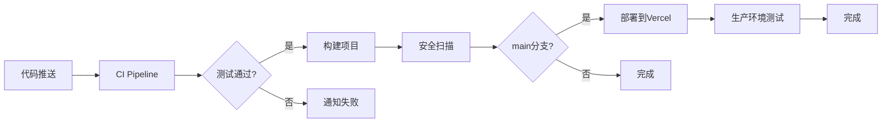

# CI/CD 设置指南

本指南帮助您完成 GitHub Actions + Vercel 的 CI/CD 配置。

## 🚀 快速开始

### 1. GitHub 仓库设置

1. 确保代码已推送到 GitHub
2. 进入仓库 Settings → Actions → General
3. 确保 "Actions permissions" 设置为 "Allow all actions"

### 2. Vercel 项目设置

1. 登录 [Vercel Dashboard](https://vercel.com)
2. 点击 "Add New Project"
3. 导入 GitHub 仓库
4. 配置项目:
   ```
   Framework Preset: Other
   Root Directory: ./
   Build Command: cd tech-validation && npm run build
   Output Directory: tech-validation/dist
   Install Command: cd tech-validation && npm install
   ```
5. 点击 "Deploy"

### 3. 获取 Vercel 凭证

1. **获取 Token**:
   - 访问 https://vercel.com/account/tokens
   - 创建新 token (Full Access)
   - 复制保存

2. **获取 Org ID**:
   - Vercel Dashboard → Settings → General
   - 复制 "Your ID"

3. **获取 Project ID**:
   - 进入项目 → Settings → General
   - 复制 "Project ID"

### 4. 配置 GitHub Secrets

在 GitHub 仓库中添加以下 Secrets:

```bash
# Vercel 部署必需
VERCEL_TOKEN=<your-vercel-token>
VERCEL_ORG_ID=<your-org-id>
VERCEL_PROJECT_ID=<your-project-id>

# API 测试密钥（可选，用于 CI 测试）
TEST_MINIMAX_API_KEY=<test-api-key>
TEST_TONGYI_API_KEY=<test-api-key>
# ... 其他测试密钥
```

### 5. 激活 Workflows

1. 将代码推送到 main 分支
2. GitHub Actions 会自动运行
3. 检查 Actions 标签页查看运行状态

## 📋 CI/CD 流程说明

### 主要 Workflows

1. **CI/CD Pipeline** (`ci.yml`)
   - 触发: Push 到 main/develop，PR 到 main
   - 功能: 代码检查、测试、构建、安全扫描

2. **Deploy to Vercel** (`deploy-vercel.yml`)
   - 触发: Push 到 main，CI 成功后
   - 功能: 部署到 Vercel 生产环境

3. **PR Check** (`pr-check.yml`)
   - 触发: PR 创建或更新
   - 功能: 代码审查、覆盖率、依赖检查

4. **Scheduled Tasks** (`scheduled-tasks.yml`)
   - 触发: 每天定时运行
   - 功能: 依赖更新、健康检查、安全扫描

### 流程图



## 🔧 本地测试

在推送前本地运行检查:

```bash
cd tech-validation

# 安装依赖
npm install

# 代码质量检查
npm run check

# 运行测试
npm run test:unit
npm run test:boundary

# 构建项目
npm run build
```

## 🚨 故障排查

### 常见问题

1. **ESLint 错误**
   ```bash
   # 自动修复
   npm run lint:fix
   ```

2. **TypeScript 错误**
   ```bash
   # 检查类型错误
   npm run typecheck
   ```

3. **部署失败**
   - 检查 Vercel Secrets 是否正确
   - 查看 Vercel 部署日志

4. **测试失败**
   - 确保环境变量已设置
   - 检查 API 服务是否可用

### 调试技巧

1. **查看详细日志**
   - GitHub Actions → 选择 workflow → 查看日志

2. **重新运行失败的 Job**
   - 在 Actions 页面点击 "Re-run failed jobs"

3. **本地模拟 CI 环境**
   ```bash
   # 使用 act 工具
   npm install -g act
   act -l  # 列出所有 jobs
   act     # 运行默认 workflow
   ```

## 📊 监控和通知

### 状态徽章

在 README.md 中添加:

```markdown


```

### 通知设置

1. **GitHub 通知**
   - Settings → Notifications → Actions

2. **Slack 集成**（可选）
   - 添加 `SLACK_WEBHOOK` Secret
   - Workflow 会自动发送通知

## 🔐 安全最佳实践

1. **密钥管理**
   - 使用 GitHub Secrets，不要硬编码
   - 定期轮换密钥
   - 使用最小权限原则

2. **分支保护**
   - Settings → Branches → Add rule
   - 要求 PR 审查
   - 要求状态检查通过

3. **依赖安全**
   - 启用 Dependabot
   - 定期运行 `npm audit`

## 📚 扩展阅读

- [GitHub Actions 文档](https://docs.github.com/en/actions)
- [Vercel 文档](https://vercel.com/docs)
- [CI/CD 最佳实践](https://www.atlassian.com/continuous-delivery/principles/continuous-integration-vs-delivery-vs-deployment)

---

**提示**: 完成设置后，每次推送代码都会自动触发 CI/CD 流程！